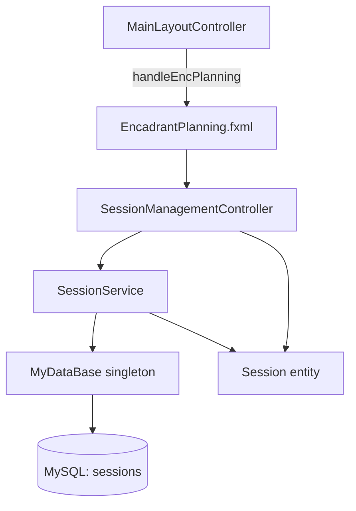
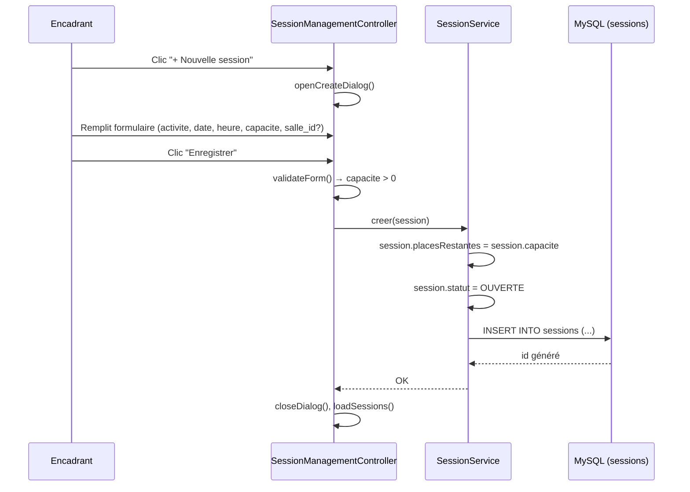
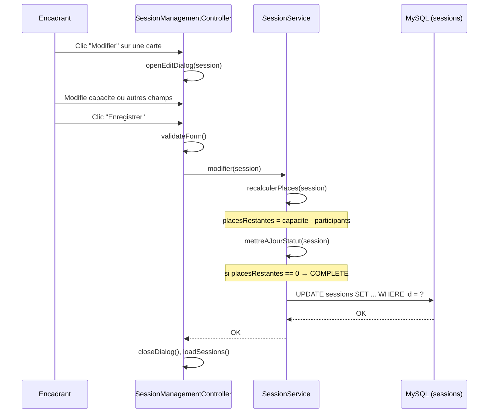
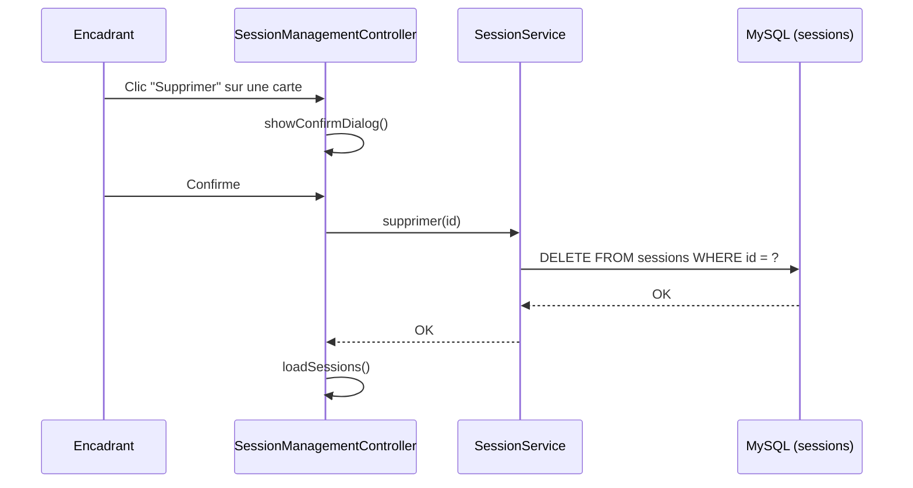

# Document de Conception : Gestion des Sessions

## Vue d'ensemble

Le module **Gestion des Sessions** permet à un encadrant (coach/responsable) de créer, consulter, modifier et supprimer des sessions sportives dans l'application OXYN. Il remplace la page `EncadrantPlanning.fxml` (actuellement un stub vide) par une interface Card View cohérente avec le design dark navy de l'application, en suivant exactement le même pattern architectural que le module `SalleManagement` (Entity → Service → DAO → Controller → FXML).

Le module gère automatiquement les invariants métier : initialisation des places restantes à la capacité totale à la création, recalcul des places restantes lors d'une modification, et passage automatique du statut `OUVERTE` → `COMPLETE` quand `places_restantes = 0`.

---

## Architecture



### Couches

| Couche | Classe | Rôle |
|--------|--------|------|
| Entity | `Session` | POJO représentant une session sportive |
| Service/DAO | `SessionService` | CRUD + logique métier (calcul places, statut) |
| Controller | `SessionManagementController` | Interactions UI, construction des cartes |
| View | `EncadrantPlanning.fxml` (remplacé) | Card View + dialog overlay |
| CSS | `sessions.css` | Styles spécifiques au module |

---

## Diagrammes de séquence

### Création d'une session



### Modification d'une session



### Suppression d'une session



---

## Composants et Interfaces

### Entité : Session

**Rôle** : POJO mappant la table `sessions` en base de données.

```java
package org.example.entities;

import java.time.LocalDate;
import java.time.LocalTime;
import java.sql.Timestamp;

public class Session {
    private int id;
    private String activite;       // "fitness", "yoga", "cardio", etc.
    private String coachNom;       // nom de l'encadrant
    private LocalDate dateSession;
    private LocalTime heureDebut;
    private int capacite;          // capacité totale (> 0)
    private int placesRestantes;   // calculé automatiquement
    private String statut;         // "OUVERTE" | "COMPLETE"
    private Integer salleId;       // nullable (FK vers gymnasia.id)
    private Timestamp createdAt;

    // constructeurs, getters, setters
}
```

**Règles de validation** :
- `activite` non vide
- `dateSession` non nulle
- `heureDebut` non nulle
- `capacite > 0`
- `placesRestantes >= 0` et `placesRestantes <= capacite`
- `statut` ∈ {"OUVERTE", "COMPLETE"}

### Service : SessionService

**Rôle** : Logique métier + accès base de données. Implémente `ICrud<Session>`.

```java
package org.example.services;

public class SessionService implements ICrud<Session> {
    void ajouter(Session s) throws SQLException;   // initialise places + statut
    void modifier(Session s) throws SQLException;  // recalcule places + statut
    void supprimer(int id) throws SQLException;    // DELETE physique
    List<Session> afficher() throws SQLException;  // toutes les sessions
    List<Session> afficherParCoach(String coachNom) throws SQLException;
}
```

**Responsabilités** :
- À la création : `placesRestantes ← capacite`, `statut ← "OUVERTE"`
- À la modification : `placesRestantes ← max(0, capacite - nbParticipants)`, `statut ← "COMPLETE"` si `placesRestantes == 0`
- Connexion via `MyDataBase.getInstance().getConnection()`

### Controller : SessionManagementController

**Rôle** : Gestion des interactions UI, construction dynamique des cartes JavaFX.

```java
package org.example.controllers;

public class SessionManagementController implements Initializable {
    // FXML bindings
    @FXML FlowPane sessionsGrid;
    @FXML Label countLabel;
    @FXML StackPane dialogOverlay;
    // champs du formulaire
    @FXML ComboBox<String> fieldActivite;
    @FXML DatePicker fieldDate;
    @FXML TextField fieldHeure;
    @FXML TextField fieldCapacite;
    @FXML ComboBox<Salle> fieldSalle;
    @FXML Label dialogError;

    // méthodes FXML
    void handleAjouter();
    void handleDialogSave();
    void handleDialogCancel();
    void handleRefresh();

    // méthodes privées
    VBox buildCard(Session s);
    void loadSessions();
    boolean validateForm();
    void openEditDialog(Session s);
    void handleSupprimer(Session s);
}
```

---

## Modèles de données

### Table SQL : sessions

```sql
CREATE TABLE IF NOT EXISTS sessions (
    id              INT AUTO_INCREMENT PRIMARY KEY,
    activite        VARCHAR(100)  NOT NULL,
    coach_nom       VARCHAR(150)  NOT NULL,
    date_session    DATE          NOT NULL,
    heure_debut     TIME          NOT NULL,
    capacite        INT           NOT NULL CHECK (capacite > 0),
    places_restantes INT          NOT NULL DEFAULT 0,
    statut          VARCHAR(20)   NOT NULL DEFAULT 'OUVERTE',
    salle_id        INT           NULL,
    created_at      DATETIME      DEFAULT CURRENT_TIMESTAMP,
    CONSTRAINT fk_session_salle
        FOREIGN KEY (salle_id) REFERENCES gymnasia(id)
        ON DELETE SET NULL
) ENGINE=InnoDB DEFAULT CHARSET=utf8mb4;
```

### Mapping Java ↔ SQL

| Champ Java | Colonne SQL | Type Java | Type SQL |
|------------|-------------|-----------|----------|
| `id` | `id` | `int` | `INT` |
| `activite` | `activite` | `String` | `VARCHAR(100)` |
| `coachNom` | `coach_nom` | `String` | `VARCHAR(150)` |
| `dateSession` | `date_session` | `LocalDate` | `DATE` |
| `heureDebut` | `heure_debut` | `LocalTime` | `TIME` |
| `capacite` | `capacite` | `int` | `INT` |
| `placesRestantes` | `places_restantes` | `int` | `INT` |
| `statut` | `statut` | `String` | `VARCHAR(20)` |
| `salleId` | `salle_id` | `Integer` (nullable) | `INT NULL` |
| `createdAt` | `created_at` | `Timestamp` | `DATETIME` |

---

## Spécifications formelles des algorithmes clés

### Algorithme : creer(Session s)

```java
/**
 * Préconditions :
 *   - s != null
 *   - s.activite != null && !s.activite.isBlank()
 *   - s.dateSession != null
 *   - s.heureDebut != null
 *   - s.capacite > 0
 *
 * Postconditions :
 *   - s.placesRestantes == s.capacite
 *   - s.statut == "OUVERTE"
 *   - Un enregistrement est inséré dans sessions avec l'id généré
 *   - s.id est mis à jour avec l'id auto-généré
 */
public void ajouter(Session s) throws SQLException {
    s.setPlacesRestantes(s.getCapacite());
    s.setStatut("OUVERTE");
    String sql = "INSERT INTO sessions (activite, coach_nom, date_session, heure_debut, " +
                 "capacite, places_restantes, statut, salle_id) VALUES (?,?,?,?,?,?,?,?)";
    // ... PreparedStatement + executeUpdate + récupération de l'id généré
}
```

**Invariant de boucle** : N/A (pas de boucle dans cette opération)

### Algorithme : modifier(Session s)

```java
/**
 * Préconditions :
 *   - s != null && s.id > 0
 *   - s.capacite > 0
 *   - nbParticipants >= 0 (nombre d'inscrits actuel, récupéré en DB)
 *
 * Postconditions :
 *   - s.placesRestantes == max(0, s.capacite - nbParticipants)
 *   - s.statut == "COMPLETE" si s.placesRestantes == 0
 *   - s.statut == "OUVERTE"  si s.placesRestantes > 0
 *   - L'enregistrement correspondant en DB est mis à jour
 */
public void modifier(Session s) throws SQLException {
    int nbParticipants = compterParticipants(s.getId()); // SELECT COUNT(*) FROM inscriptions WHERE session_id = ?
    int restantes = Math.max(0, s.getCapacite() - nbParticipants);
    s.setPlacesRestantes(restantes);
    s.setStatut(restantes == 0 ? "COMPLETE" : "OUVERTE");
    String sql = "UPDATE sessions SET activite=?, coach_nom=?, date_session=?, heure_debut=?, " +
                 "capacite=?, places_restantes=?, statut=?, salle_id=? WHERE id=?";
    // ... PreparedStatement + executeUpdate
}
```

**Invariant** : `0 <= placesRestantes <= capacite` est toujours vrai après l'appel.

### Algorithme : validateForm() dans le Controller

```java
/**
 * Préconditions :
 *   - Les champs FXML sont initialisés
 *
 * Postconditions :
 *   - Retourne true ssi tous les champs obligatoires sont valides
 *   - Si false : dialogError affiche le premier message d'erreur rencontré
 *
 * Règles (dans l'ordre) :
 *   1. activite non vide
 *   2. date non nulle
 *   3. heure au format HH:mm
 *   4. capacite est un entier > 0
 */
private boolean validateForm() {
    if (fieldActivite.getValue() == null || fieldActivite.getValue().isBlank()) {
        dialogError.setText("L'activité est obligatoire.");
        return false;
    }
    if (fieldDate.getValue() == null) {
        dialogError.setText("La date est obligatoire.");
        return false;
    }
    String heure = fieldHeure.getText().trim();
    if (!heure.matches("^([01]\\d|2[0-3]):[0-5]\\d$")) {
        dialogError.setText("Heure invalide (format HH:mm).");
        return false;
    }
    try {
        int cap = Integer.parseInt(fieldCapacite.getText().trim());
        if (cap <= 0) throw new NumberFormatException();
    } catch (NumberFormatException e) {
        dialogError.setText("La capacité doit être un entier supérieur à zéro.");
        return false;
    }
    dialogError.setText("");
    return true;
}
```

---

## Interface utilisateur (FXML)

### Structure de EncadrantPlanning.fxml (remplacé)

```
StackPane (root)
├── ScrollPane (page principale)
│   └── VBox (page-root)
│       ├── VBox (titre + sous-titre)
│       ├── HBox (toolbar: "+ Nouvelle session" | Actualiser)
│       ├── HBox (compteur: "N session(s)")
│       └── FlowPane#sessionsGrid (cartes dynamiques)
└── StackPane#dialogOverlay (dialog-overlay, visible=false)
    └── ScrollPane
        └── VBox#dialogCard (session-dialog-card)
            ├── Label#dialogTitle
            ├── ComboBox#fieldActivite
            ├── DatePicker#fieldDate
            ├── TextField#fieldHeure (HH:mm)
            ├── TextField#fieldCapacite
            ├── ComboBox#fieldSalle (optionnel)
            ├── Label#dialogError
            └── HBox (Annuler | Enregistrer)
```

### Anatomie d'une carte Session

```
VBox.session-card (prefWidth=300)
├── VBox.session-card-header (activite + badge statut)
│   ├── Label.session-card-activite  (ex: "🏋️ Fitness")
│   └── Label.session-badge-ouverte | .session-badge-complete
├── VBox.session-card-body
│   ├── HBox (👤 coachNom)
│   ├── HBox (📅 dateSession)
│   ├── HBox (🕐 heureDebut)
│   ├── HBox (👥 capacite places — placesRestantes restantes)
│   └── HBox (🏢 nomSalle ou "—")
└── HBox.session-card-actions
    ├── Button.session-btn-edit   "Modifier"
    └── Button.session-btn-delete "Supprimer"
```

---

## Gestion des erreurs

### Scénario 1 : Capacité invalide

**Condition** : L'encadrant saisit une capacité ≤ 0 ou non numérique.
**Réponse** : `validateForm()` retourne `false`, `dialogError` affiche "La capacité doit être un entier supérieur à zéro."
**Récupération** : Le dialog reste ouvert, l'encadrant corrige la valeur.

### Scénario 2 : Erreur SQL à la création/modification

**Condition** : `SQLException` levée par `SessionService`.
**Réponse** : `dialogError.setText("Erreur : " + e.getMessage())`.
**Récupération** : Le dialog reste ouvert, les données ne sont pas perdues.

### Scénario 3 : Erreur de chargement de la liste

**Condition** : `SQLException` lors de `afficher()`.
**Réponse** : `countLabel.setText("Erreur de chargement")`, stack trace loggée.
**Récupération** : L'encadrant peut cliquer "Actualiser" pour réessayer.

### Scénario 4 : Salle supprimée (FK NULL)

**Condition** : La salle référencée par `salle_id` est désactivée/supprimée.
**Réponse** : `ON DELETE SET NULL` en DB, la carte affiche "—" pour la salle.
**Récupération** : Aucune action requise, la session reste valide.

---

## Stratégie de tests

### Tests unitaires

- `SessionServiceTest` : tester `ajouter()`, `modifier()`, `supprimer()`, `afficher()` avec une connexion de test ou mock.
- Cas limites : capacité = 1, capacité = Integer.MAX_VALUE, modification avec 0 participants, modification avec participants = capacité.

### Tests de propriétés (Property-Based Testing)

**Bibliothèque** : jqwik (Java property-based testing)

**Propriété 1** : Invariant de création
```
∀ session avec capacite > 0 :
  après ajouter(session) →
    session.placesRestantes == session.capacite ∧
    session.statut == "OUVERTE"
```

**Propriété 2** : Invariant de modification
```
∀ session avec capacite > 0, nbParticipants ∈ [0, capacite] :
  après modifier(session, nbParticipants) →
    session.placesRestantes == capacite - nbParticipants ∧
    (placesRestantes == 0 → statut == "COMPLETE") ∧
    (placesRestantes > 0 → statut == "OUVERTE")
```

**Propriété 3** : Borne des places restantes
```
∀ session après toute opération :
  0 <= session.placesRestantes <= session.capacite
```

### Tests d'intégration

- Vérifier que `handleEncPlanning()` dans `MainLayoutController` charge bien `EncadrantPlanning.fxml` avec le nouveau controller.
- Vérifier que la FK `salle_id → gymnasia.id` est respectée (insertion avec salle existante, insertion sans salle).

---

## Considérations de performance

- `FlowPane` rechargé entièrement à chaque `loadSessions()` — acceptable pour un volume de sessions < 500. Si le volume croît, envisager une pagination ou un `VirtualFlow`.
- La requête `afficher()` utilise `ORDER BY date_session DESC, heure_debut ASC` pour un affichage chronologique naturel.
- `compterParticipants()` dans `modifier()` est un `SELECT COUNT(*)` indexé sur `session_id` — O(1) avec index.

---

## Considérations de sécurité

- Toutes les requêtes SQL utilisent des `PreparedStatement` avec paramètres liés — protection contre les injections SQL.
- `coachNom` est initialisé depuis `SessionContext.getInstance().getDisplayName()` (valeur de session authentifiée), non depuis un champ libre.
- La validation côté controller (`validateForm()`) est doublée côté service pour éviter les contournements.

---

## Dépendances

| Dépendance | Usage |
|------------|-------|
| `MyDataBase` (singleton existant) | Connexion MySQL |
| `SessionContext` (singleton existant) | Récupérer le nom du coach connecté |
| `SalleService` (existant) | Peupler le ComboBox des salles dans le formulaire |
| `ICrud<T>` (interface existante) | Contrat de service |
| `salles.css` (existant) | Réutilisation des styles `.dialog-overlay`, `.salle-field`, `.salle-btn-edit`, `.salle-btn-delete` |
| `sessions.css` (nouveau) | Styles spécifiques aux cartes de session |
| JavaFX 21 | `DatePicker`, `ComboBox`, `FlowPane`, `StackPane` |
| MySQL Connector/J | Driver JDBC |
